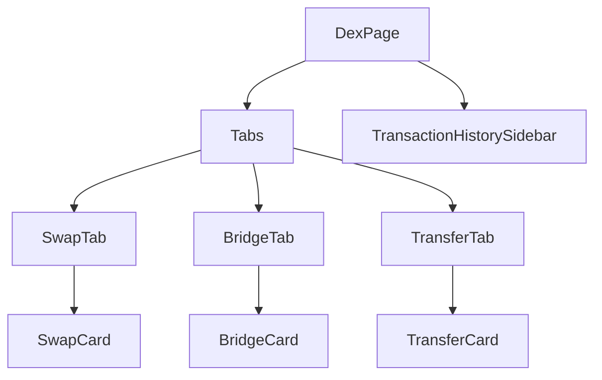

# DEX Redesign & Cross-Chain Architecture

## 1. Overview

This document outlines the architectural changes required to transform the current `Dex.tsx` page into a comprehensive Asset Management Hub. The new design will support:

1.  **Same-Chain Swaps**: ETH <-> USDC, etc.
2.  **Cross-Chain Bridging**: BTC -> SOL, ETH -> AR, etc.
3.  **Asset Transfers**: Sending tokens to other addresses (with cross-chain safety checks).
4.  **Transaction Tracking**: Persistent history of long-running cross-chain operations.

## 2. Component Architecture

The `DexPage` will be refactored to use a Tab-based layout, hosting three distinct "Feature Cards".



### 2.1 SwapCard (Refactored)

- **Purpose**: Handle atomic swaps on the _same chain_.
- **Logic**: Reuses existing `useMultiHopSwap` and `useInternalDexSwap`.
- **UI**:
  - Token Selector (Filtered by current chain).
  - Settings (Slippage).
  - Quote Display.

### 2.2 BridgeCard (New)

- **Purpose**: Handle cross-chain asset movement.
- **Logic**:
  - **Source Chain/Token** vs **Dest Chain/Token** selection.
  - Integration with `@aryxn/sdk-bridge` for quotes and execution.
- **UI**:
  - Two-column or top-down selection for Source/Dest networks.
  - Estimated Time of Arrival (ETA) display (Critical for UX).
  - "Bridge & Swap" status indicator.

### 2.3 TransferCard (New)

- **Purpose**: Send assets to another user/address.
- **Logic**:
  - Simple `sendTransaction` or ERC20 `transfer` calls.
  - **Safety Check**: Validate if the destination address matches the source chain format (e.g., warn if pasting a SOL address for an ETH transfer).
- **UI**:
  - Recipient Address Input.
  - Amount Input.
  - "Max" button.

### 2.4 TransactionHistory (New)

- **Purpose**: Track asynchronous operations, specifically bridges that take 10+ minutes.
- **Persistence**: Must survive page reloads.
- **Implementation**: `zustand` store with `persist` middleware.

## 3. Data Models

### 3.1 Bridge Transaction Record

```typescript
interface BridgeTransaction {
  id: string // UUID
  timestamp: number
  type: "BRIDGE" | "SWAP" | "TRANSFER"
  status: "PENDING" | "COMPLETED" | "FAILED"

  // Asset Details
  fromToken: string
  toToken: string
  fromAmount: string
  toAmount: string // Estimated

  // Chain Details
  fromChain: string
  toChain: string

  // Tracking
  sourceTxHash: string
  destTxHash?: string // Populated when complete
  bridgeExplorerUrl?: string
}
```

## 4. Implementation Steps

### Phase 1: Component Refactoring

1.  Extract current `Dex.tsx` logic into `components/dex/SwapCard.tsx`.
2.  Create shared UI components for Token Selectors to be reused by Bridge/Transfer.

### Phase 2: Bridge Implementation

1.  Implement `BridgeCard.tsx`.
2.  Connect to `BridgeService` (mocked initially, but structured for real API).
3.  Implement `useBridgeHistory` store using Zustand.

### Phase 3: Transfer Implementation

1.  Implement `TransferCard.tsx`.
2.  Add address validation utils (Regex for EVM, SOL, BTC, Arweave addresses).

### Phase 4: Integration

1.  Assemble `DexPage` with Tabs.
2.  Add `TransactionHistory` sidebar/drawer.
3.  Integrate with Global Navigation (optional: show pending tx badge on nav).

## 5. UX Considerations

- **Cross-Chain Warning**: When users select a different chain in "Transfer", explicitly ask if they mean to Bridge instead.
- **Progress Visibility**: "Bridging takes time" notification should be prominent.
- **Wallet Connection**: Ensure the correct wallet (Source Chain) is requested when switching tabs.
