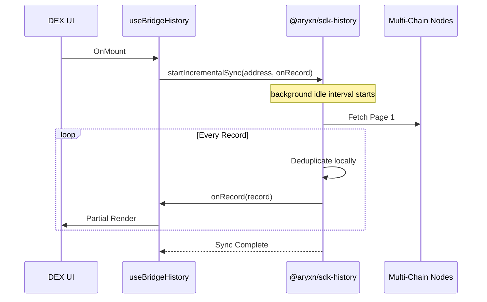

# Technical Design: Multi-Chain History Synchronization

## 1. Context
Currently, the DEX implementation (`Swap`, `Bridge`, `Send`) relies on a local Zustand store (`useBridgeHistory`) for transaction tracking. While this provides immediate UI feedback (e.g., "Pending" status), it has two major limitations:
1. **Device Locking**: Users cannot see their transaction history when switching devices.
2. **Data Loss**: Clearing browser cache wipes the history.

## 2. Objective
Implement an on-chain history discovery mechanism that:
- Automatically fetches relevant transactions from multiple blockchains (Ethereum, Solana, Arweave, Bitcoin).
- Merges these chain-sourced records with local temporary records.
- Deduplicates entries to ensure a clean, unified list.
- Persists found records locally to avoid redundant heavy API calls.

## 3. Architecture: `@aryxn/sdk-history`

We will introduce a new package centered around an `AggregateHistoryProvider`.

### 3.1 Unified Interface
```typescript
interface ChainRecord {
  id: string; // Typically Transaction Hash
  chain: 'ethereum' | 'solana' | 'arweave' | 'bitcoin' | 'sui';
  type: 'SWAP' | 'BRIDGE' | 'SEND' | 'RECEIVE' | 'UNKNOWN';
  status: 'COMPLETED' | 'FAILED' | 'PENDING';
  from: string;
  to: string;
  amount: string;
  token: string;
  timestamp: number;
  fee?: string;
}

interface IHistoryAdapter {
  fetchRecords(address: string, options?: FetchOptions): Promise<ChainRecord[]>;
}
```

### 3.2 Adapters (API Sources)
To ensure reliability, we prioritize official RPCs and industry-standard open-source indexers:

| Chain | Source | Status | Protocol |
| :--- | :--- | :--- | :--- |
| **Arweave** | `arweave.net/graphql` | **Official** | GraphQL |
| **Solana** | Mainnet RPC (`solana.com`) | **Official** | JSON-RPC |
| **Sui** | Mainnet RPC (`sui.io`) | **Official** | JSON-RPC |
| **Ethereum** | Blockscout V2 API | **Industry Standard (OS)** | REST |
| **Bitcoin** | Mempool.space / Esplora | **Industry Standard (OS)** | REST |

*Note: For Ethereum, Etherscan can be added as a fallback, but Blockscout is used as the default open-source standard.*

## 4. Workflow: Sync Logic

### 4.1 Non-Blocking Incremental Sync
To prevent UI jank and excessive memory usage, the sync process will follow these principles:
- **Idle Processing**: Use `requestIdleCallback` to run the sync logic when the main thread is not busy.
- **Streaming/Incremental Updates**: Instead of a monolithic `Promise.all`, the SDK will provide a stream-like interface or a callback (e.g., `onRecordFound`) that triggers a store update for each validated record.
- **Chunked Processing**: Fetch results in batches and process a small number of records per idle interval.

### 4.2 Updated Sequence


## 5. Performance & Memory Management
- **Streaming State**: The store will maintain a `syncingStatus` but update the `transactions` array reactively.
- **Virtualization**: The `TransactionHistory` component should use virtualization (e.g., `react-window`) if the list grows large.
- **LRU Cache (Internal)**: The SDK will use a small internal cache of processed hashes to avoid re-validating the same data within a session.

## 6. Implementation Stages
1. **Initial Setup**: Create `@aryxn/sdk-history` with an event-driven or callback-based querying interface.
2. **Idle Wrapper**: Implement a utility to wrap fetchers in `requestIdleCallback`.
3. **Incremental Store Updates**: Update `useBridgeHistory` to handle per-item additions without re-filtering the entire list.
4. **UI Integration**: Show live progress indicator (e.g., "Found 12 records...").

## 6. Security & Privacy
- Querying is done client-side directly from the SDK to public indexers.
- No private keys are involved; only public addresses are used for querying.
