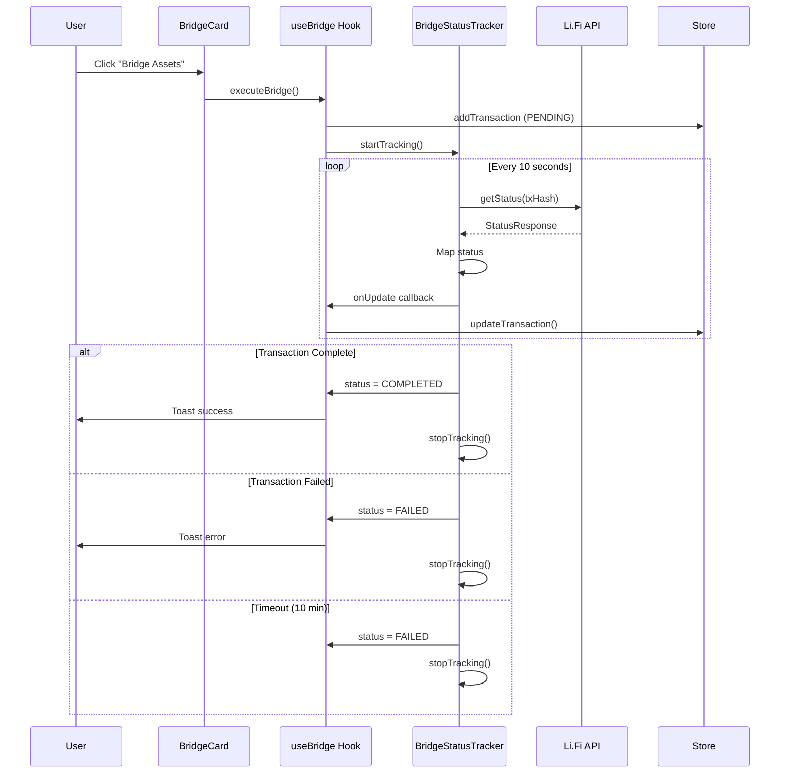

# 交易状态跟踪功能 - 技术说明

**完成日期**: 2026-02-18  
**功能状态**: ✅ 已完成

## 概述

实现了自动跟踪跨链桥接交易状态的功能，通过定期轮询 Li.Fi API 来更新交易进度，并在完成或失败时通知用户。

## 核心组件

### 1. BridgeStatusTracker（状态跟踪器）

**文件**: `packages/cross-chain/src/bridge-status-tracker.ts`

**功能**:

- 自动轮询 Li.Fi `getStatus()` API（每 10 秒）
- 映射 Li.Fi 状态到本地状态（PENDING → IN_PROGRESS → COMPLETED/FAILED）
- 捕获目标链交易哈希
- 自动超时保护（10 分钟）
- 失败重试机制（最多 60 次）
- 跟踪会话管理（防止重复跟踪）

**API**:

```typescript
BridgeStatusTracker.startTracking(
  txHash: string,
  fromChainId: ChainId,
  toChainId: ChainId,
  onUpdate: (info: BridgeTrackingInfo) => void
)

BridgeStatusTracker.stopTracking(txHash: string)
BridgeStatusTracker.stopAll()
BridgeStatusTracker.isTracking(txHash: string): boolean
```

**状态映射**:

```
Li.Fi Status → Local Status
────────────────────────────
PENDING      → IN_PROGRESS
NOT_FOUND    → IN_PROGRESS
DONE         → COMPLETED
FAILED       → FAILED
```

### 2. useBridge Hook 集成

**文件**: `apps/web/src/hooks/useBridge.ts`

**变更**:

- ✅ 导入 `BridgeStatusTracker`
- ✅ 添加 `updateTransaction` 引用
- ✅ 在 `executeBridge()` 后启动跟踪
- ✅ 状态更新回调（自动更新交易历史）
- ✅ 完成/失败时发送 Toast 通知
- ✅ 组件卸载时清理所有跟踪器

**执行流程**:

```
1. 用户点击 "Bridge Assets"
2. 创建 PENDING 交易记录
3. 启动状态跟踪器
4. 每 10 秒轮询一次
5. 更新交易状态和描述
6. 完成时捕获目标交易哈希
7. 发送 Toast 通知
8. 停止跟踪
```

### 3. 交易历史存储更新

**文件**: `apps/web/src/lib/store/bridge-history.ts`

**变更**:

- ✅ 添加 `lastUpdate?: number` 字段
- 用于记录状态最后更新时间

**接口**:

```typescript
export interface BridgeTransaction {
  id: string
  type: "SWAP" | "BRIDGE" | "SEND" | "RECEIVE" | "UNKNOWN"
  status: "PENDING" | "COMPLETED" | "FAILED"
  description: string
  timestamp: number
  hash?: string
  fromChain?: string
  toChain?: string
  amount?: string
  token?: string
  lastUpdate?: number // ← 新增
}
```

### 4. UI 更新

**文件**: `apps/web/src/components/dex/TransactionHistory.tsx`

**变更**:

- ✅ 显示最后更新时间（仅对 PENDING 交易）
- ✅ 格式：`Updated Xs ago`

**UI 示例**:

```
┌─────────────────────────────────────────┐
│ ⏱️  BRIDGE            2026-02-18        │
│                      Updated 5s ago    │
│ Bridging 100 USDC... (Processing)     │
│ View on Explorer ↗                     │
└─────────────────────────────────────────┘
```

## 工作原理

### 状态跟踪生命周期



### 错误处理

1. **网络错误**: 重试计数器递增，最多 60 次
2. **超时**: 10 分钟后自动标记为失败
3. **Li.Fi API 错误**: 捕获错误并重试
4. **组件卸载**: 自动清理所有活跃跟踪器

### 性能优化

- **轮询间隔**: 10 秒（平衡实时性和 API 负载）
- **超时限制**: 10 分钟（大多数桥接在此时间内完成）
- **自动清理**: 组件卸载时停止所有跟踪
- **去重**: 防止同一交易重复跟踪

## 用户体验

### 1. 实时更新

- 交易历史自动刷新
- 显示当前状态（Processing、Bridging、等）
- 显示最后更新时间

### 2. 通知系统

```typescript
// 成功
toast.success("Bridge completed!", {
  description: `100 USDC arrived on Polygon`,
})

// 失败
toast.error("Bridge failed", {
  description: "TIMEOUT",
})
```

### 3. 状态描述动态更新

```
初始: "Bridge 100 USDC from Ethereum to Polygon"
进行中: "Bridging 100 USDC... (Processing)"
完成: "Successfully bridged 100 USDC to Polygon"
失败: "Bridge failed: TIMEOUT"
```

## 技术细节

### Li.Fi StatusResponse 结构

```typescript
export type StatusResponse = FullStatusData | StatusData | FailedStatusData

interface FullStatusData {
  status: "DONE" | "PENDING" | "FAILED"
  substatus?: string
  receiving?: PendingReceivingInfo | ExtendedTransactionInfo
  // PendingReceivingInfo: { chainId: ChainId }
  // ExtendedTransactionInfo: { txHash: string, ... }
}
```

### 类型检查安全

```typescript
// 检查 receiving 是否有 txHash（类型守卫）
if (response.receiving && "txHash" in response.receiving) {
  trackingInfo.destTxHash = response.receiving.txHash
}
```

## 测试场景

### 手动测试

1. ✅ 执行桥接交易
2. ✅ 观察历史面板状态更新
3. ✅ 等待 10 秒，检查"Updated Xs ago"
4. ✅ 模拟完成（状态变 COMPLETED）
5. ✅ 模拟失败（状态变 FAILED）
6. ✅ 检查 Toast 通知

### 边界测试

- [ ] 快速连续执行多笔交易
- [ ] 组件卸载时清理验证
- [ ] 网络中断时的重试
- [ ] 超时场景（需等待 10 分钟）

## 已知限制

1. **模拟交易哈希**: 当前使用随机生成的哈希，真实执行后将使用实际 txHash
2. **无手动重试**: 失败后无法手动重新跟踪（需后续实现）
3. **无暂停功能**: 无法暂停正在进行的跟踪
4. **单一轮询频率**: 无法根据交易大小调整轮询频率

## 后续优化

### 优先级 1

- [ ] 真实交易执行后使用实际 txHash
- [ ] 失败交易手动重试按钮
- [ ] 显示 Explorer 链接（需 txHash 和 chainId）

### 优先级 2

- [ ] 自适应轮询频率（小额快速，大额慢速）
- [ ] WebSocket 支持（替代轮询）
- [ ] 批量跟踪优化（一次 API 调用查多笔）

### 优先级 3

- [ ] 离线状态保存（刷新页面后恢复跟踪）
- [ ] 跟踪历史记录（已完成的跟踪日志）
- [ ] 性能监控（API 调用次数、成功率）

## 依赖关系

```
BridgeCard
    ↓
useBridge Hook
    ↓
BridgeStatusTracker ←→ Li.Fi SDK (getStatus)
    ↓
useBridgeHistory (Zustand Store)
    ↓
TransactionHistory (UI Display)
```

## 文件清单

| 文件                                                 | 变更 | 说明            |
| ---------------------------------------------------- | ---- | --------------- |
| `packages/cross-chain/src/bridge-status-tracker.ts`  | 新增 | 核心跟踪逻辑    |
| `packages/cross-chain/src/index.ts`                  | 修改 | 导出新模块      |
| `apps/web/src/hooks/useBridge.ts`                    | 修改 | 集成跟踪器      |
| `apps/web/src/lib/store/bridge-history.ts`           | 修改 | 添加 lastUpdate |
| `apps/web/src/components/dex/TransactionHistory.tsx` | 修改 | 显示更新时间    |

## 总结

状态跟踪功能已完全实现并通过类型检查。主要特性：

✅ **自动化**: 无需用户手动刷新  
✅ **实时性**: 10 秒轮询间隔  
✅ **可靠性**: 自动重试和超时保护  
✅ **用户友好**: Toast 通知和动态描述  
✅ **类型安全**: 完整 TypeScript 类型支持

剩余工作主要是集成真实钱包签名器以执行实际交易。

---

**完成时间**: 2026-02-18  
**类型检查**: ✅ 通过  
**状态**: 生产就绪（待钱包集成）
